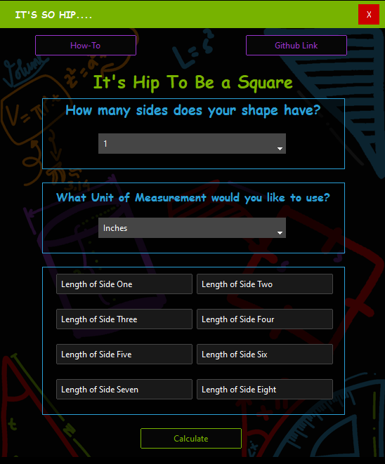
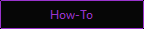
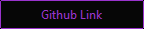
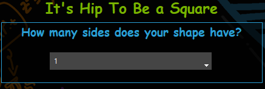
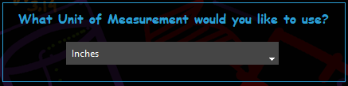
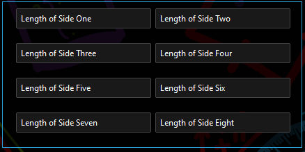

# :small_blue_diamond: It's Hip To Be A Square :small_blue_diamond:
### A :triangular_ruler: geometry application made with :snake: Python and Tkinter

### The project is a simple executable application with the following requirements:
- It must contain two buttons at the top. One that opens a how-to and one that opens a link to the Github where the program is hosted.
- It must contain a field that allows the users to select the amount of sides that a shape contains.
  - This field may be a combobox, an entry or even a radio/checkbox type
  - This field must block users from selecting any other value other than a number(no floats allowed)
  - This field can be bound by the programmer (meaning defining a max/min amount of sides)
- It must contain a Unit of Measurement selection
  - The programmer may define the units of measurement
  - The programmer may use an entry field, combobox or any other input type
  - Validation must be performed on this field, users should not be able to select/create bad values. Bad value examples:
    - Any string that is a non-unit of measurement (Like 'banana', 'apple123', 123.33, etc)
- It must contain entry fields for the lengths of each side.
  - The entry fields should be bound to the sides selection and dynamically appear based on the input value of the sides entry.
  - The side length entry fields should contain validation. At a minimum they should:
    - Delete the default contents when the user clicks in the field
    - Verify that only numbers are typed into the field, as well as a . " " or backspace. Do not allow a . after a backspace, etc.
- It must contain a Calculate button at the bottom. The calculate button should do the following:
  - Create a pop-up/modal that shows the final calculations in a separate window. This window should contain a close button
  - Clear the fields on the application main form and reset to default so that it can be used again.
- Any design style may be used. Any background, any button style, and any colors. The programmer may name the program anything that they deem appropriate.

### :art: My Design

### :books: Non-Standard Libraries Used:
- ttkbootstrap - A simply smashing modern library for tkinter
- Pillow - For images n' stuff

### :question: The how-to button

- Easy Peasy Lemon Squeezy
  - Opens a how-to modal that explains how the program/application works

### :traffic_light: The Github Link Button

- Opens a link to this here Github page. 

### :card_index: Sides select dropdown and title

- Allows the user to select the amount of sides that their shape contains. Bound to 1 - 8 sides (I didn't want users to be able to select infinite sides)
- Users cannot select 2 sides. Why? Because that is weird. One side is a circle, but two sides is a shape that I still do not understand.
- Users cannot hand input sides. I used a combobox for this. Default value is set to 1

### :straight_ruler: Unit of Measurement Dropdown

- Allows the user to select a predefined unit of measurement. Set to Inches by default. User input not allowed, must select from dropdown.
- Mixed in some metric measurements for fun......

### :straight_ruler: Side Length User Entry

- Dynamic side entry field. By default none of these entry fields appear on the application. Fields appear based on the sides selected in the 'how many sides' dropdown field.
- Validation ignores any key that is not a number, a period, a space or a backspace key. 

### :rotating_light: Calculate Button

- When clicked, a modal pops up with geometric calculations for the shape. Default values are reset to the application

## :interrobang: More Information......
This application heavily.....actually exclusively uses the canvas element of Tkinter. Why? Well, I designed a background image
in photoshop to be used as the background of the application. This is a no no no in Tkinter using standard placement (grid, pack, place)
as the background of any labels that I put on top of the image would definitely not be able to be matched to the color in the 
background image. So, canvas was the way to go with this particular application. It was not fun. I did not enjoy it. 

The entry fields contain validation within the application class. Normally, it would be better (and more OOPy) to create a 
Entry child class like ValidatedEntry and then use that whenever a validated entry field was needed. HOWEVER!!!! This application
only needed one entry field (used up to 8 times), and there is no expansion expected of the application. Creating a validate function was easier
and made more sense for such limited use. 

